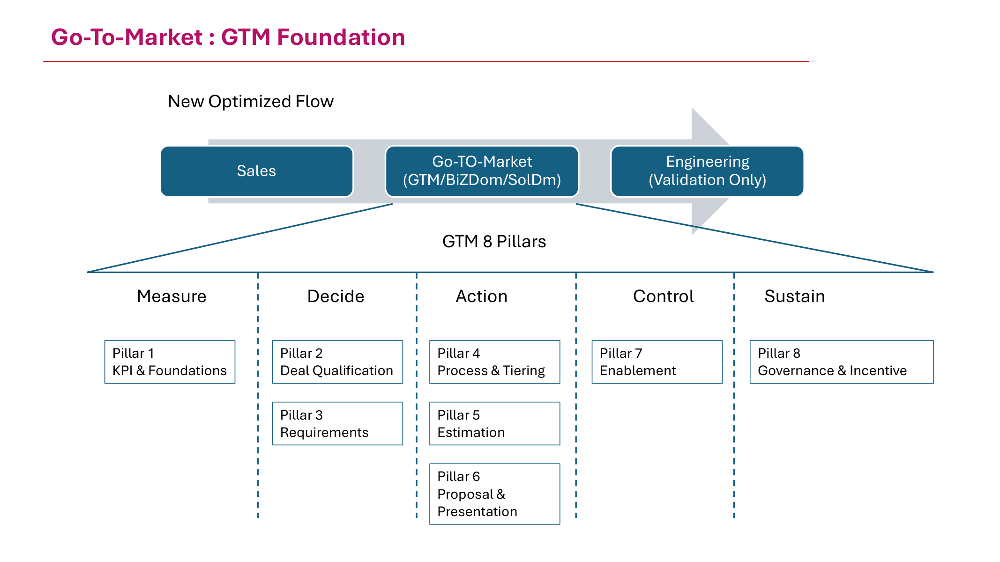
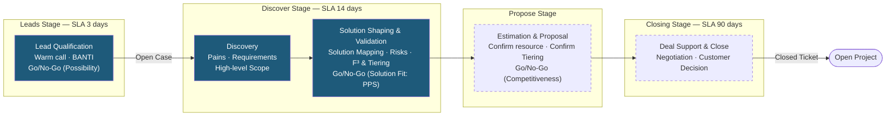
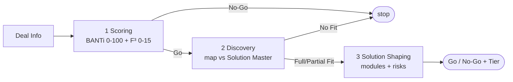

# GTM Deal Pipeline (POC)

[](https://github.com/rungrojcsi/GTM-DealPipeline/actions/workflows/ci.yml)

A three-stage deal qualification pipeline powered by Claude with a Gradio UI — a supporting tool for the GTM process (Pillar 2 Deal Qualification + Pillar 4 Processes & Tiering).

> **Status: POC Phase** — a prototype to prove the approach, not a production system: data is stored as local CSV files, single-user only, and the Estimation & Proposal stage is not covered yet.
>
> **Internal use only — CSI GROUPS.** Run artifacts (deals_log.csv, feedback CSVs, optimized prompt) contain real deal data — they are excluded via `.gitignore` and must never be committed.

## 1. Pain Points

Problems in the deal qualification process before this tool existed:

- **Qualification relied on individual judgment** — the BANTi-F³ criteria were defined in Pillar 2, but actual scoring depended on whoever assessed the deal, so results were inconsistent and not comparable across deals.
- **Low-potential deals slipped through and consumed effort** — no gate was actually enforced before Discovery, so the solution team spent time on deals with low possibility.
- **Solution matching was slow and person-dependent** — knowledge of which solution answers which requirement lived in people's heads with no central repository, making the Discover Stage SLA (14 days) hard to meet.
- **Decisions were not captured as data** — Go/No-Go, Tier, and reasoning were never recorded systematically, so win rate / cost per stage (the KPIs in Pillar 1) could not be measured retrospectively.

## 2. Gap

The gap between the GTM framework as designed and the tools that existed:

| Designed in the framework | What was missing |
|---------------------------|------------------|
| Pillar 2 — clear BANTi-F³ criteria | No scoring aid that applies the same criteria to every deal |
| Pillar 4 — three gates (Possibility / Solution Fit / Competitiveness) | The first two gates had no system support — done in slides / manual spreadsheets |
| Solution portfolio | No central solution master that agents or new joiners could reference |
| Continuous improvement (Pillar 8) | No loop feeding real decision feedback back into the criteria |

## 3. Concept

Use an LLM (Claude) as the agent at each gate — **AI proposes, humans decide**:

1. **One agent per gate**, following Pillar 4: Scoring (Possibility) → Discovery → Solution Shaping (Solution Fit: PPS)
2. **Criteria written down in the prompt** — every BANTi component has a fixed definition; output is JSON that can be audited and logged for every deal
3. **Human-in-the-loop** — every stage lets a person correct the result (correct Go/No-Go, correct Tier) with a reason
4. **Self-improvement loop** — the Prompt Optimizer takes cases the AI got wrong from the feedback log and asks the LLM to propose an improved prompt (apply/rollback supported) — addressing Pillar 8

## 4. Where It Sits in the GTM Process

Where the concept above plugs into the real process — starting from the big picture, then zooming into Pillar 4:

### GTM Foundation — the 8 Pillars

This tool is part of the GTM 8 Pillars (New Optimized Flow: Sales → Go-To-Market → Engineering) — supporting **Pillar 2 Deal Qualification** and **Pillar 4 Process & Tiering**:



### Business workflow (Pillar 4 : Processes and Tiering)

The actual sales process from the official deck (stages + SLA + gates + Prospects Tiering):


Where this tool sits in the process above — solid boxes are stages the POC already covers, dashed boxes are not in the POC yet:



| Workflow stage | POC status | App tab |
|----------------|------------|---------|
| Lead Qualification (BANTI, Go/No-Go) | ✅ Covered | 1. Scoring |
| Discovery (pains / requirements / scope) | ✅ Covered | 2. Discovery |
| Solution Shaping & Validation (F³, Tiering, PPS gate) | ✅ Covered | 3. Solution Shaping |
| Estimation & Proposal | ⏳ Not yet (Proceed to Estimation button reserved) | — |
| Deal Support & Close | ⏳ Out of POC scope | — |

#### Prospects Tiering

The F³ result from the Scoring/Shaping stages determines the proposal tier (MB = million THB):

| Tier | Proposal approach | Deal profile | Value | Owner (PC) |
|------|-------------------|--------------|-------|------------|
| 1 | Template Propose | Solution fit, low customization, low risk | >1 MB | BizDomain |
| 2 | Proposal Propose (Story-Driven) | Customization, competitive | 1–3 MB | BizDomain, SolDomain |
| 3 | Consulting Propose (Strategic-Driven) | Complex, C-Level | >5 MB | GTM, SolDomain |

## 5. Design

Design principles:

- **Clear layering**: agents (logic + prompt) / `llm_utils.py` (shared core) / `render.py` (presentation) / `app.py` (UI wiring) — every agent can be run standalone from the CLI without opening the UI
- **Data contract as a JSON schema in the prompt** — output structure is enforced so it stays machine-readable; no free-form text accepted
- **Solution knowledge separated from code** — `solution_master.md` can be edited without touching the program
- **Every deal logged** (CSV during the POC phase) — auto-generated deal_id links the results of all three stages together, browsable in the History tab
- **Fully offline tests** — a fake client replaces the real API; tests run with no key and no cost

### In-app pipeline (3 agents)



| Stage | File | Role |
|-------|------|------|
| 1. Scoring | `scoring_agent.py` | Scores BANTi (0-100) + F³ (0-15) → Go/No-Go + Tier 1-3 |
| 2. Discovery | `discovery_agent.py` | Maps pains/requirements against `solution_master.md` → Full Fit / Partial Fit / Full Custom |
| 3. Solution Shaping | `solution_shaping_agent.py` | Designs modules + function list + assesses risks → second Go/No-Go |

### Project layout

```
app.py                     Gradio UI — 5 tabs (Scoring / Discovery / Shaping / History / Prompt Optimizer)
render.py                  HTML render helpers + colors/labels (no Gradio dependency)
llm_utils.py               Shared core: client, model, JSON parsing, solution master loader
scoring_agent.py           Stage 1 — BANTi-F³ qualification
discovery_agent.py         Stage 2 — solution fit mapping
solution_shaping_agent.py  Stage 3 — solution design + risk
solution_master.md         Company solution knowledge base (used by agents 2-3)
examples/example-deal.txt  Sample input (entirely fictional)
tests/                     Unit tests — all external calls mocked, no real API calls
```

The UI records user feedback to CSV, and the **Prompt Optimizer** tab feeds cases the AI got wrong to the LLM to propose an improved prompt (apply/rollback supported).

## 6. Implementation (POC status)

| Item | Status |
|------|--------|
| Scoring agent (BANTi-F³ + Go/No-Go + Tier) | ✅ Working |
| Discovery agent (matching against the solution master) | ✅ Working |
| Solution Shaping agent (modules/functions + F³ + PPS gate) | ✅ Working |
| Gradio UI 5 tabs + History log + deal_id linking all 3 stages | ✅ Working |
| Feedback loop + Prompt Optimizer (apply/rollback) | ✅ Working |
| 77 unit tests (offline, fake client) + CI (ruff + pytest) | ✅ Green |
| Estimation & Proposal agent (3rd gate: Competitiveness) | ⏳ Not started — Proceed button reserved |
| Real database replacing CSV + multi-user support | ⏳ Pending POC results |
| Deployment for team use (currently local-only) | ⏳ Out of POC scope |

## Run

```bash
python -m venv venv && source venv/bin/activate
pip install -r requirements.txt
export ANTHROPIC_API_KEY=sk-ant-...
python app.py
```

## Tests & lint

```bash
pip install pytest ruff
pytest tests/
ruff check .
```

The 77-case test suite uses a fake client (`tests/_fakes.py`) — no real API calls, no key required. CI runs both lint and tests on every push/PR.

## Notes

- The API key is read from the `ANTHROPIC_API_KEY` env var only — never hardcode it in a file.
- The proposal evaluation system lives in a separate repo: [Proposal-Evaluator](https://github.com/rungrojcsi/Proposal-Evaluator)
